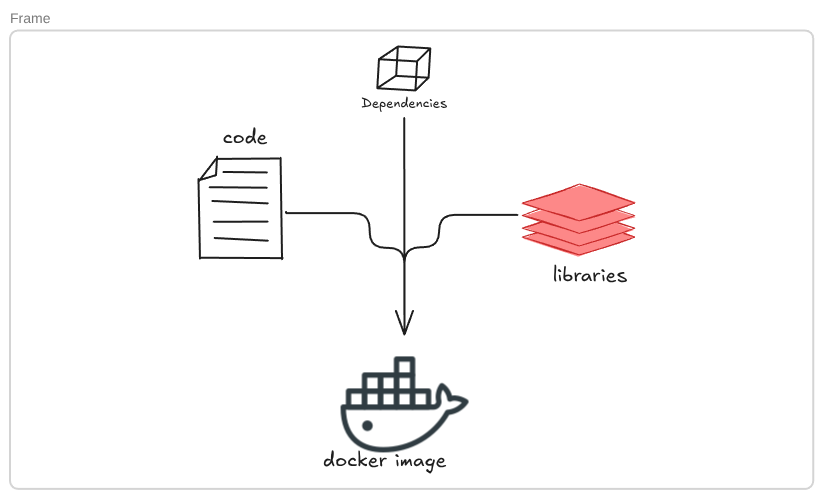

# Developer Documentation

This file describes how a developer can set up, manage, and understand the internal architecture of the project.

## Setting up the Environment from Scratch
1. **Prerequisites**: You must have `make`, `docker`, and `docker-compose` (or `docker compose` plugin) installed.
2. **Host Configuration**: Edit your `/etc/hosts` file to point `ehamza.42.fr` to `127.0.0.1`.
3. **Configuration & Secrets**: Create a `.env` file inside the `srcs/` directory. This file must contain the necessary database credentials, WordPress setup variables, and domain names. (Refer to `.env.example` if provided). 
4. **Data Directories**: The Makefile will automatically create the local host directories mapped to Docker volumes (e.g., `/home/ehamza/data/wordpress` and `/home/ehamza/data/mariadb`) before launching the containers.

## Building and Launching the Project

Use the provided `Makefile` at the root of the repository:
- `make` or `make all`: Creates necessary directories, builds the Docker images from the provided Dockerfiles, and starts the stack using `docker-compose.yml`.
- `make build`: Only builds or rebuilds the Docker images.
- `make clean`: Stops and removes the containers and networks.
- `make fclean`: Performs a deep clean—stops containers, removes networks, deletes all project-related images, and destroys the named volumes (wiping all data).
- `make re`: Runs `fclean` followed by `all`.

## Managing Containers and Volumes
Useful Docker commands for development and debugging:
- **Enter a running container**: `docker exec -it <container_name> sh` (or `bash`)
- **View live logs**: `docker-compose -f srcs/docker-compose.yml logs -f`
- **Inspect Network**: `docker network inspect inception_network` (to verify embedded DNS and IP allocations).
- **List Volumes**: `docker volume ls`

## Project Data and Persistence
Data persistence is handled via **Docker Named Volumes** bound to specific paths on the host machine. 
- **WordPress Files**: Stored in the `wp_data` volume, physically mapped to `/home/ehamza/data/wordpress` on the host. This ensures themes, plugins, and core files survive container restarts.
- **Database Files**: Stored in the `db_data` volume, physically mapped to `/home/ehamza/data/mariadb` on the host. This guarantees that database tables and records are not lost when the MariaDB container goes down.

Because we use Named Volumes rather than simple Bind Mounts, Docker manages the initial permissions and seeding of the directories, preventing the common `root:root` permission errors when the containers start up.
