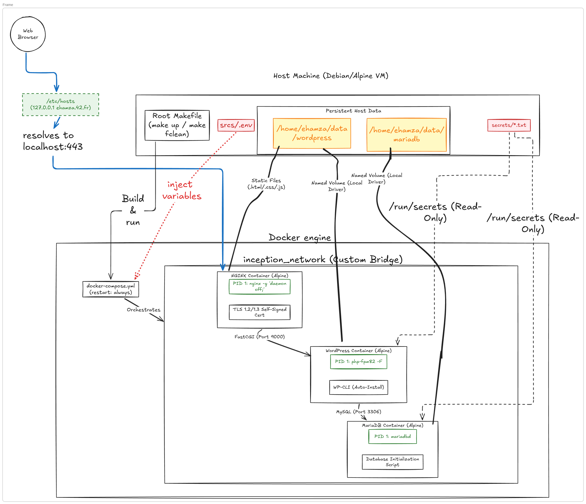
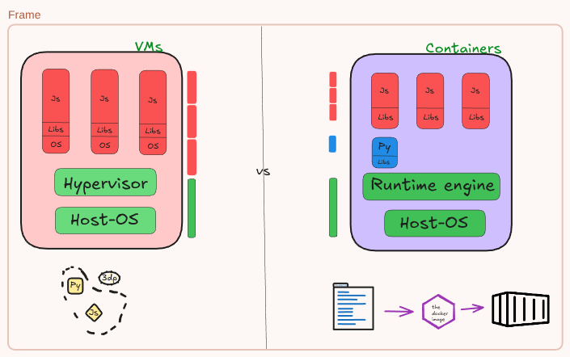

*This project has been created as part of the 42 curriculum by ehamza.*

# Inception

## Description



The goal of this project is to broaden our knowledge of system administration by using Docker. We are required to virtualize several Docker images, creating them in our own personal virtual machine. The project consists of setting up a small infrastructure composed of different services (NGINX, WordPress, and MariaDB) operating under specific rules and communicating over a dedicated Docker network.

This infrastructure is built using Docker and Docker Compose. Each service runs in its own dedicated container, built from Alpine Linux or Debian base images. 

### Main Design Choices & Comparisons

To ensure a secure and scalable architecture, several fundamental design choices were made:

#### Virtual Machines vs Docker



Virtual Machines (VMs) include the application, the necessary binaries/libraries, and an entire guest operating system, all of which run on top of a hypervisor. This makes them heavy and resource-intensive. Docker containers, on the other hand, share the host system's kernel and isolate the application processes. Containers are lightweight, start almost instantly, and consume a fraction of the memory compared to a full VM, making them ideal for microservice architectures like this one.

#### Secrets vs Environment Variables
Using environment variables (via `.env` files) to pass sensitive credentials introduces multiple attack vectors. They can be exposed in plain text via `docker inspect`, leak into crash logs, and are inherited by all child processes. 
To eliminate these exposure paths, this project utilizes **Docker Secrets** (or file-based mounts). Secrets are mounted as files in a memory-backed filesystem (`tmpfs`) at `/run/secrets/`. They never appear in container metadata, are never written to disk, and are only accessible to the specific processes that read the file.

#### Docker Network vs Host Network
A **Host Network** removes all network isolation, allowing a container to share the host's network stack directly. This is an architectural anti-pattern and a security risk, as it allows containers to sniff host traffic and creates port conflicts.
Instead, this project uses a **User-Defined Bridge Network**. It provides full isolation, giving each container its own network namespace and IP address. More importantly, it leverages Docker's embedded DNS server (`127.0.0.11`), allowing our NGINX container to seamlessly route traffic to the WordPress container using its service name (e.g., `fastcgi_pass wordpress:9000;`) without relying on hardcoded, fragile IP addresses.

#### Docker Volumes vs Bind Mounts
**Bind Mounts** map an exact host path directly into the container, hard-wiring the stack to a specific host structure and often causing UID/GID permission conflicts.
This project uses **Named Volumes**. Named Volumes abstract away the host filesystem and are managed entirely by Docker (stored in `/var/lib/docker/volumes/`). They persist independently of container lifecycles, handle permissions gracefully, and are entirely portable across different Docker hosts.

---

## Instructions

### Compilation & Installation
To set up the project, ensure that Docker and Docker Compose are installed on your system.
You will need to map the domain name to your localhost in your `/etc/hosts` file:
```bash
127.0.0.1 ehamza.42.fr
```

Clone the repository and place your environment variables in the designated `.env` file (or `secrets/` directory as required by the setup).

### Execution
The entire infrastructure is managed via a `Makefile`. 

To build and start the infrastructure in the background:
```bash
make all
```

To stop the infrastructure:
```bash
make down
```

To completely clean the project (stopping containers, removing networks, images, and volumes):
```bash
make fclean
```

---

## Resources

- [Docker Documentation](https://docs.docker.com/)
- [NGINX Official Documentation](https://nginx.org/en/docs/)
- [MariaDB Knowledge Base](https://mariadb.com/kb/en/)
- [WordPress Developer Resources](https://developer.wordpress.org/)

### AI Usage
Artificial Intelligence (LLMs) was used during this project strictly as a research and educational assistant. Specifically, AI was used to:
- Summarize documentation on Docker network bridging and embedded DNS functionality.
- Compare architectural differences between Bind Mounts and Named Volumes.
- Help generate and format these Markdown documentation files based on my personal research notes.
No raw code was blindly copied; AI served to clarify systems architecture and TLS/SSL configurations for NGINX.
